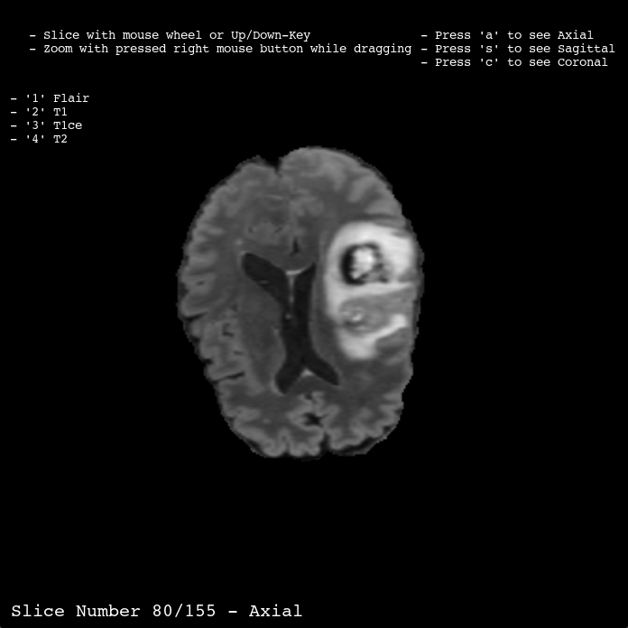

# MRI_Visualizer

This project aims to visualize MRI scans using DICOM (DCM) and NIfTI (NII) file formats. The project uses PyQt to deploy a GUI to visualize the MRI files and choose files, uses VTK for rendering and displaying the medical images with the option of switching the cross-sectional orientation.

## Build on

- Python 3.12.2
- PyQt5 5.15.10
- VTK 9.4.1

## Features
- Load NIfTI (.nii, .nii.gz) and DICOM (.dcm) series. 
- View FLAIR, T1, T1CE, T2. 
- Custom interaction.
- Switch modalities with keys 1-4. 
- Change orientations (Axial, Coronal, Sagittal).

## How it looks



## Requirements
Make sure you have the following dependencies installed:
```
pip install vtk PyQt5 
```

## How to run 
```
python main.py
```